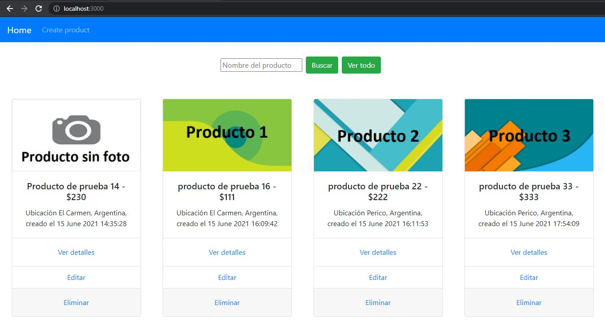

<!-- PROJECT LOGO -->
<br />
<p align="center">
  <a href="https://github.com/ttiago7/cryptoclient">
    
  </a> 

  <h3 align="center">MX commerce Client with React</h3>

  <p align="center">
    Project description: MX commerce client to create and update posts
    <br />
    <a href="https://github.com/ttiago7/crypto/"><strong>Explore the docs »</strong></a>
    <br />
    <br />
    <a href="https://github.com/ttiago7/mxcommerce">View Backend repo</a>
    ·
    <a href="https://github.com/ttiago7/mxcommerce-front">View Frontend repo</a>
  </p>
</p>


<!-- TABLE OF CONTENTS -->
<details open="open">
  <summary><h2 style="display: inline-block">Table of Contents</h2></summary>
  <ol>
    <li>
      <a href="#built-with">Built With</a>      
    </li>
    <li>
      <a href="#getting-started">Getting Started</a>
      <ul>
        <li><a href="#prerequisites">Prerequisites</a></li>
        <li><a href="#installation">Installation</a></li>
      </ul>
    </li>
    <li><a href="#usage">Usage</a></li>
    <li><a href="#contact">Contact</a></li>
  </ol>
</details>


### Built With

* React
* Redux, redux-thunk
* Axios
* ducks
* bootstrap
* react-router-dom
* react-hook-form

<!-- GETTING STARTED -->
## Getting Started

Instructions on setting up this project locally. To get a local copy up and running follow these simple steps.

### Prerequisites

* Git
* node JS
* NPM


### Installation

1. Run the backend, in this <a href="https://github.com/ttiago7/mxcommerce">repo</a> you find the simple steps to up the Api rest
2. Clone the repo
   ```sh
   git clone https://github.com/ttiago7/mxcommerce-front.git
   ```
2. Open the command line in this repo, into this execute next command
   ```sh
   npm install
   ```
   ```sh
   npm start
   ```


<!-- USAGE EXAMPLES -->
## Usage

1. In your browser open http://localhost:3000/ 
2. the client allow create new post and update this

3. Delete posts

4. Search posts

5. See detaills


<!-- CONTACT -->
## Contact

Calizaya Santiago - [@linkedin-ttiago7](https://www.linkedin.com/in/ttiago7/) - c.ttiago7@gmail.com
